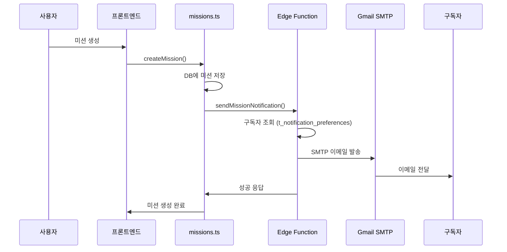

# 📧 Gmail SMTP 이메일 알림 설정 완료 가이드

RealPick 이메일 알림 시스템이 준비되었습니다! 이제 설정만 하면 됩니다.

---

## ✅ 완료된 작업

### 1. **코드 구현 완료**
- ✅ Supabase Edge Function (`send-mission-notification`)
- ✅ Gmail SMTP 연동 코드
- ✅ 이메일 HTML 템플릿
- ✅ 미션 생성 시 자동 알림 발송
- ✅ 사용자 알림 설정 테이블 스키마

### 2. **파일 구조**
```
realpick-1/
├── supabase/functions/send-mission-notification/
│   └── index.ts                           # Edge Function (Gmail SMTP)
├── lib/supabase/
│   └── email-notification.ts              # 알림 발송 유틸리티
├── scripts/
│   └── setup_email_notifications.sql      # DB 설정 SQL
└── docs/
    └── GMAIL_SMTP_SETUP.md                # 상세 설정 가이드
```

---

## 🚀 빠른 시작 (5단계)

### Step 1: Gmail 앱 비밀번호 생성 (5분)

1. [Google 계정](https://myaccount.google.com/) → **보안** → **2단계 인증** 활성화
2. [앱 비밀번호 생성](https://myaccount.google.com/apppasswords)
   - 앱: "메일"
   - 기기: "RealPick"
3. 생성된 16자리 비밀번호 복사 (예: `abcdefghijklmnop`)

---

### Step 2: 데이터베이스 설정 (2분)

1. [Supabase 대시보드](https://supabase.com/dashboard) 접속
2. **SQL Editor** 클릭
3. `scripts/setup_email_notifications.sql` 파일 내용 복사 & 실행

```sql
-- 또는 직접 실행:
CREATE EXTENSION IF NOT EXISTS pg_net;

CREATE TABLE IF NOT EXISTS t_notification_preferences (
  f_id UUID PRIMARY KEY DEFAULT gen_random_uuid(),
  f_user_id UUID NOT NULL REFERENCES t_users(f_id) ON DELETE CASCADE,
  f_email_enabled BOOLEAN DEFAULT true,
  f_categories TEXT[] DEFAULT ARRAY['LOVE', 'VICTORY', 'STAR']::TEXT[],
  f_created_at TIMESTAMPTZ DEFAULT NOW(),
  f_updated_at TIMESTAMPTZ DEFAULT NOW(),
  UNIQUE(f_user_id)
);

-- ... (나머지는 파일 참조)
```

---

### Step 3: Supabase Edge Function 배포 (5분)

#### 3-1. Supabase CLI 설치

```powershell
# Windows (Scoop)
scoop bucket add supabase https://github.com/supabase/scoop-bucket.git
scoop install supabase

# 로그인
supabase login
```

#### 3-2. Edge Function 배포

```powershell
cd C:\Users\USER\realpick-1

# Project Ref 확인: Supabase 대시보드 → Settings → API → Project URL
# 예: https://abcdefghijk.supabase.co → project-ref는 "abcdefghijk"

supabase functions deploy send-mission-notification --project-ref YOUR_PROJECT_REF
```

---

### Step 4: 환경 변수 설정 (3분)

#### Supabase 대시보드에서 설정

1. **Edge Functions** → `send-mission-notification` → **Settings** → **Secrets**
2. 다음 변수 추가:

| 키 | 값 | 예시 |
|---|---|---|
| `SMTP_USER` | Gmail 주소 | `your-email@gmail.com` |
| `SMTP_PASS` | 앱 비밀번호 (16자리) | `abcdefghijklmnop` |

✅ `SUPABASE_URL`, `SUPABASE_SERVICE_ROLE_KEY`는 자동 설정됨

---

### Step 5: 테스트 (2분)

#### 5-1. 알림 설정 확인
1. RealPick 웹사이트 → **설정** → **알림 설정**
2. 이메일 알림 **켜기**
3. 카테고리 선택 (로맨스, 서바이벌, 오디션)

#### 5-2. 테스트 미션 생성
1. 새 미션 생성
2. **카테고리 선택** (중요!)
3. 미션 게시

#### 5-3. 이메일 확인
- Gmail 받은편지함 확인
- 발신자: `RealPick <your-email@gmail.com>`
- 제목: `[RealPick] 새로운 로맨스 미션!`

⚠️ **스팸함 확인**: 처음에는 스팸으로 분류될 수 있습니다.

---

## 🔍 동작 방식



---

## 📊 발송 제한 & 비용

### Gmail SMTP 무료 제한
- ✅ **일일 발송량**: 500통
- ✅ **비용**: 완전 무료
- ⚠️ **제한 초과 시**: 24시간 후 자동 복구

### 발송량이 많아지면?
- **Resend**: 월 3,000통 무료
- **SendGrid**: 월 100통 무료
- **AWS SES**: 월 62,000통 무료 (EC2 사용 시)

---

## 🛠️ 문제 해결

### "SMTP not configured" 에러
```bash
# Supabase 대시보드 → Edge Functions → Secrets 확인
SMTP_USER=your-email@gmail.com
SMTP_PASS=abcdefghijklmnop
```

### "Authentication failed" 에러
1. Gmail 2단계 인증 활성화 확인
2. 앱 비밀번호 재생성
3. 공백 제거 확인 (`abcd efgh` → `abcdefgh`)

### 이메일이 안 옴
1. **Edge Function 로그 확인**:
   ```powershell
   supabase functions logs send-mission-notification --project-ref YOUR_PROJECT_REF
   ```

2. **알림 설정 확인**:
   - Supabase → Table Editor → `t_notification_preferences`
   - `f_email_enabled = true` 확인
   - `f_categories`에 해당 카테고리 포함 확인

3. **Gmail 스팸함 확인**

4. **카테고리 누락 확인**:
   - 미션 생성 시 **카테고리를 반드시 선택**해야 함
   - 카테고리가 없으면 알림 발송 안 됨

---

## 📁 관련 파일

| 파일 | 설명 |
|------|------|
| `supabase/functions/send-mission-notification/index.ts` | Edge Function (Gmail SMTP) |
| `lib/supabase/email-notification.ts` | 알림 발송 유틸리티 |
| `lib/supabase/missions.ts` | 미션 생성 시 알림 호출 |
| `scripts/setup_email_notifications.sql` | DB 설정 SQL |
| `scripts/create_notification_preferences.sql` | 알림 설정 테이블 |
| `app/p-settings/notifications/page.tsx` | 알림 설정 UI |
| `docs/GMAIL_SMTP_SETUP.md` | 상세 설정 가이드 |

---

## 🎯 다음 단계 (선택사항)

### 1. Database Trigger 설정 (자동화)
현재는 API에서 직접 호출하지만, Database Trigger를 설정하면 완전 자동화 가능:

```sql
-- scripts/create_mission_notification_trigger.sql 참조
```

### 2. 이메일 템플릿 커스터마이징
`supabase/functions/send-mission-notification/index.ts`의 `generateEmailTemplate()` 함수 수정

### 3. 알림 종류 추가
- 댓글 알림
- 좋아요 알림
- 미션 마감 알림
- 포인트 획득 알림

---

## ✅ 체크리스트

설정 완료 여부를 확인하세요:

- [ ] Gmail 앱 비밀번호 생성
- [ ] `t_notification_preferences` 테이블 생성
- [ ] Supabase CLI 설치 및 로그인
- [ ] Edge Function 배포
- [ ] Supabase Secrets 설정 (SMTP_USER, SMTP_PASS)
- [ ] 테스트 미션 생성
- [ ] 이메일 수신 확인

---

## 📞 지원

문제가 발생하면:
1. Edge Function 로그 확인
2. `docs/GMAIL_SMTP_SETUP.md` 상세 가이드 참조
3. Supabase 대시보드 → Edge Functions → Logs

---

**🎉 설정 완료 후 미션을 생성하면 자동으로 이메일 알림이 발송됩니다!**

